 
 

  

  <h3 align="center"> 이세플 </h3>

  

    <em>  <a style="text-decoration:line-through" href="https://isgplay.com">https://isgplay.com</a> </em>
      배포 중단
     
     
     
  

 
 

# About This Project

**이세플**(이세계 플레이어)는 스트리머들의 커버곡 스트리밍 웹 애플리케이션 서비스 입니다.

 
 

# Functions

## Support PWA Install
Native Application 처럼 사용 가능하도록 **PWA** 설치를 지원합니다
| Android                           | iOS                               | Windows/macOS                     |
| --------------------------------- | --------------------------------- | --------------------------------- |
| 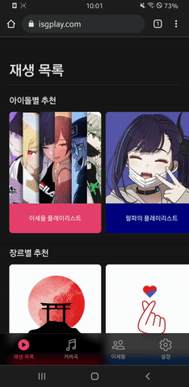 | 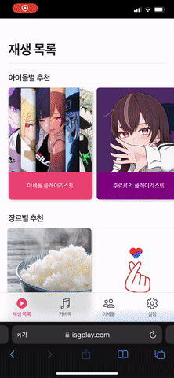 | 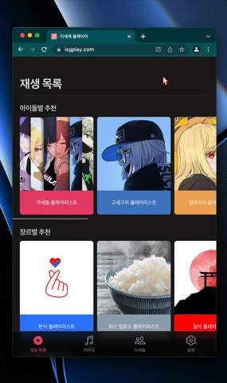 |
 

## Music Player
재생, 일시정지, 다음/이전곡 재생, 볼륨조절, 한곡/전체 반복, 셔플, 시간 변경이 가능합니다

| Player                         | Playlist Play                               | 
| --------------------------------- | --------------------------------- |
| 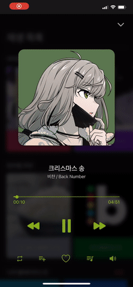 | 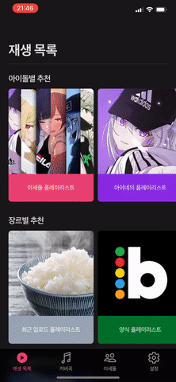 |
 

## Playlist
플레이리스트 생성, 수정/삭제, 백업/공유가 가능합니다
| Create                         | Modify / Delete                               | Backup/Share by online                    |
| --------------------------------- | --------------------------------- | --------------------------------- |
| 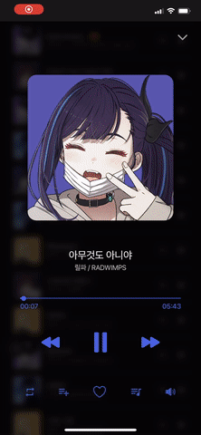 | 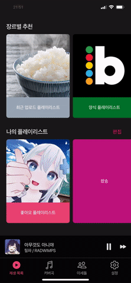 | 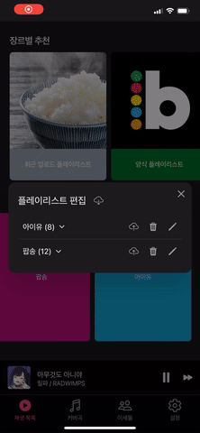 |
 

## Search
곡 검색 및 필터링, 정렬을 지원합니다

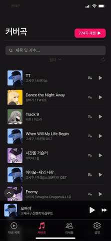
 

## Twitch / Youtube
실시간 Twitch 방송 여부, 최근 업로드된 Youtube 영상을 확인할 수 있습니다

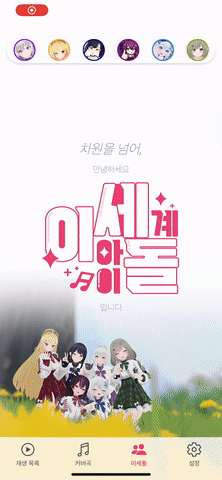
 

## Settings
한/영/일 언어 지원, 다크모드, 일러스트 숨기기, 애니메이션 비활성화, 종료 예약 기능을 지원합니다
| Language                         | Dark mode                               |
| --------------------------------- | --------------------------------- | 
|  |  |

| Hide Illust                         | Timer                               |
| --------------------------------- | --------------------------------- | 
| 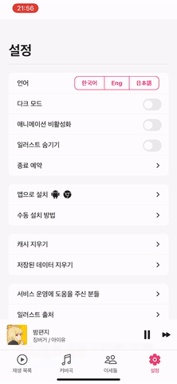 | 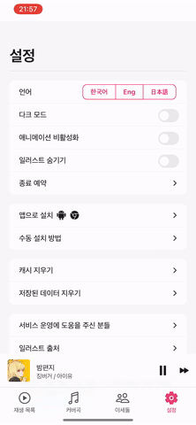 |
 

 
 

# Tech Used

### Server

   

### Backend

 

### External API

 

### Frontend

 
 

# Service Architecture

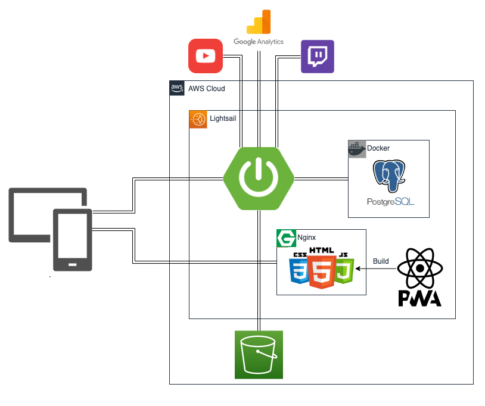
 
 

# Opensource Library

| Library                                                              | License | Description                                   |
| -------------------------------------------------------------------- | ------- | --------------------------------------------- |
| [NextUI](https://nextui.org)                                         | MIT     | React UI library                              |
| [Axios](https://github.com/axios/axios)                              | MIT     | For client http request                       |
| [NoSleep.js](https://github.com/richtr/NoSleep.js)                   | MIT     | Enable iOS playing music on background status |
| [React Swipeable](https://github.com/FormidableLabs/react-swipeable) | MIT     | Detect the client's swiping                   |

 
 

---

**UI** inspired by [Apple Music](https://www.apple.com/kr/apple-music/) / [iOS](https://www.apple.com/kr/ios/ios-15/)

 <a href='https://github.com/mskim9967/isedol-cover-streaming/blob/main/LICENSE'>
	The MIT License (MIT)
     
   	Copyright ⓒ 2022 isgplay
</a>
